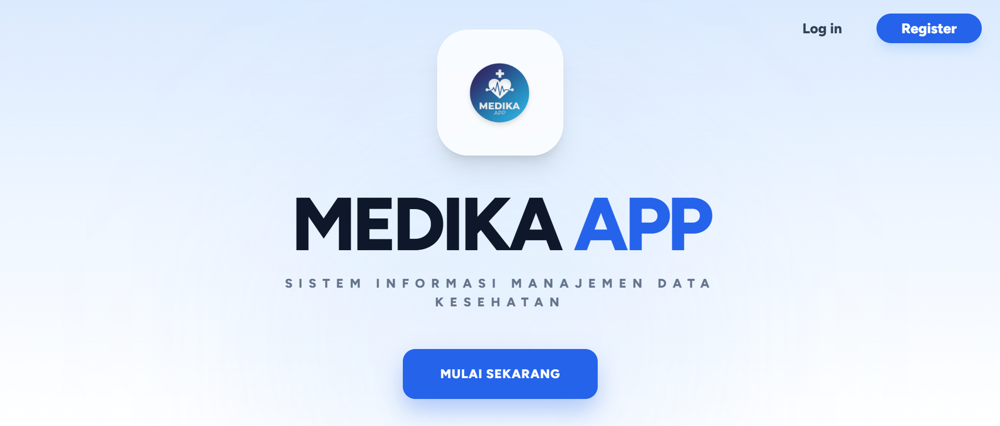

#  🏥 Medika App 



Medika App merupakan aplikasi web yang dikembangkan menggunakan framework Laravel 12. Aplikasi ini dibuat untuk membantu menyediakan sistem informasi dengan tampilan yang sederhana, nyaman digunakan, dan mudah dikembangkan.

##  Fitur

* Sistem informasi berbasis web
* Tampilan antarmuka yang sederhana dan responsif
* Pengelolaan data menggunakan database MySQL
* Menggunakan Laravel sebagai framework utama

## Teknologi

* Laravel
* Composor
* PHP
* MySQL
* HTML
* CSS
* JavaScript
* Bootstrap

## How to Run Project

Clone repository terlebih dahulu:

```bash
git clone https://github.com/USERNAME/medika-app.git
cd medika-app
```

Install dependency:

```bash
composer install
npm install
```

Buat file `.env`, lalu sesuaikan konfigurasi database MySQL.

Setelah itu jalankan:

```bash
php artisan key:generate
php artisan migrate
php artisan serve
```

Kemudian buka aplikasi melalui:

```text
http://127.0.0.1:8000
```

##  Catatan

Pastikan **PHP, Composer, Node.js, dan MySQL** sudah terinstall sebelum menjalankan project.

---

